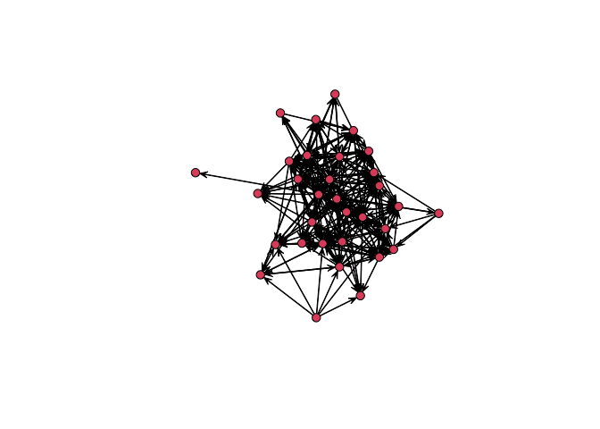

ps3
================

## comm 6750, lab 3: getting network data into R and doing simple calculations

### required packages

``` r
library(sna)
```

    ## Loading required package: statnet.common

    ## 
    ## Attaching package: 'statnet.common'

    ## The following objects are masked from 'package:base':
    ## 
    ##     attr, order

    ## Loading required package: network

    ## 
    ## 'network' 1.18.1 (2023-01-24), part of the Statnet Project
    ## * 'news(package="network")' for changes since last version
    ## * 'citation("network")' for citation information
    ## * 'https://statnet.org' for help, support, and other information

    ## sna: Tools for Social Network Analysis
    ## Version 2.7-1 created on 2023-01-24.
    ## copyright (c) 2005, Carter T. Butts, University of California-Irvine
    ##  For citation information, type citation("sna").
    ##  Type help(package="sna") to get started.

### reading in and converting senator data

``` r
senator_data <- read.csv("/Users/kenjinchang/github/phd-problemsets/data/nys_senators_edgelist.csv")
senator_data_asmat <- as.matrix(senator_data)
```

### creating network

``` r
senator_data_asnet <- as.network(senator_data_asmat)
```

### network visualization

``` r
gplot(senator_data_asnet)
```

<!-- -->

### calculating density

``` r
gden(senator_data_asnet)
```

    ## [1] 0.3024194

### calculating reciprocity

``` r
grecip(senator_data_asnet,measure="edgewise")
```

    ##       Mut 
    ## 0.5333333

this represents the portion of edges that are reciprocated.

``` r
grecip(senator_data_asnet)
```

    ##       Mut 
    ## 0.7177419

while this represents the portion of dyads that are reciprocated.

### repeating steps using igraph

``` r
detach("package:sna",unload=TRUE)
detach("package:network", unload=TRUE)
```

``` r
library(igraph)
```

    ## 
    ## Attaching package: 'igraph'

    ## The following objects are masked from 'package:stats':
    ## 
    ##     decompose, spectrum

    ## The following object is masked from 'package:base':
    ## 
    ##     union

``` r
dim(senator_data_asmat)
```

    ## [1] 300   2

``` r
mat <- as.matrix(read.csv("/Users/kenjinchang/github/phd-problemsets/data/nys_senators_edgelist.csv"),rownames=1,header=TRUE) 
mat %>% head(6)
```

    ##   follower  followee     
    ## 1 "Amedore" "LaValle"    
    ## 2 "Amedore" "Hannon"     
    ## 3 "Amedore" "Ortt"       
    ## 4 "Amedore" "Lanza"      
    ## 5 "Amedore" "Bonacic"    
    ## 6 "Amedore" "DeFrancisco"

g1 \<-
graph_from_adjacency_matrix(adjmatrix=mat,mode=“directed”,diag=TRUE)

having trouble configuring the data to fit the function requirements -
will revisit when I have more time.
