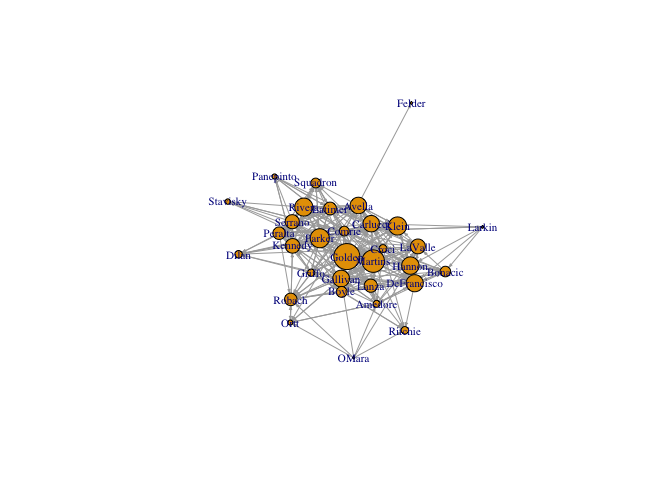
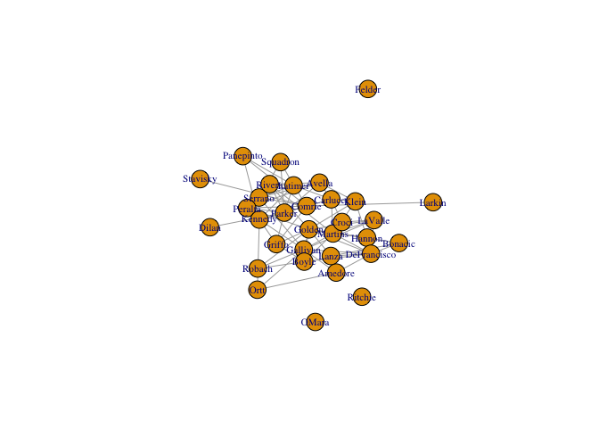

ps4
================
2023-09-27

## loading in igraph

``` r
library(igraph)
```

    ## 
    ## Attaching package: 'igraph'

    ## The following objects are masked from 'package:stats':
    ## 
    ##     decompose, spectrum

    ## The following object is masked from 'package:base':
    ## 
    ##     union

## reading in ‘nys_senator’ data

``` r
senator_edgelist <- read.csv("/Users/kenjinchang/github/phd-problemsets/data/nys_senators_edgelist.csv")
senator_edgelist
```

    ##        follower    followee
    ## 1       Amedore     LaValle
    ## 2       Amedore      Hannon
    ## 3       Amedore        Ortt
    ## 4       Amedore       Lanza
    ## 5       Amedore     Bonacic
    ## 6       Amedore DeFrancisco
    ## 7       Amedore      Golden
    ## 8       Amedore      Griffo
    ## 9       Amedore     Martins
    ## 10      Amedore    Gallivan
    ## 11       Avella      Parker
    ## 12       Avella     LaValle
    ## 13       Avella      Hannon
    ## 14       Avella    Carlucci
    ## 15       Avella     Serrano
    ## 16       Avella     Peralta
    ## 17       Avella      Rivera
    ## 18       Avella       Klein
    ## 19       Avella    Squadron
    ## 20      Bonacic     LaValle
    ## 21      Bonacic      Hannon
    ## 22      Bonacic       Lanza
    ## 23      Bonacic DeFrancisco
    ## 24      Bonacic      Golden
    ## 25      Bonacic     Martins
    ## 26        Boyle      Parker
    ## 27        Boyle     LaValle
    ## 28        Boyle      Hannon
    ## 29        Boyle       Lanza
    ## 30        Boyle    Carlucci
    ## 31        Boyle DeFrancisco
    ## 32        Boyle      Golden
    ## 33        Boyle      Griffo
    ## 34        Boyle     Serrano
    ## 35        Boyle     Kennedy
    ## 36        Boyle     Martins
    ## 37        Boyle    Gallivan
    ## 38        Boyle       Croci
    ## 39        Boyle      Robach
    ## 40        Boyle     Ritchie
    ## 41     Carlucci     LaValle
    ## 42     Carlucci      Avella
    ## 43     Carlucci     Peralta
    ## 44     Carlucci       Klein
    ## 45     Carlucci     Kennedy
    ## 46     Carlucci     Martins
    ## 47     Carlucci       Croci
    ## 48     Carlucci     Latimer
    ## 49       Comrie      Parker
    ## 50       Comrie     LaValle
    ## 51       Comrie      Hannon
    ## 52       Comrie        Ortt
    ## 53       Comrie       Lanza
    ## 54       Comrie     Bonacic
    ## 55       Comrie    Carlucci
    ## 56       Comrie DeFrancisco
    ## 57       Comrie      Golden
    ## 58       Comrie      Griffo
    ## 59       Comrie     Serrano
    ## 60       Comrie      Avella
    ## 61       Comrie    Stavisky
    ## 62       Comrie     Peralta
    ## 63       Comrie      Rivera
    ## 64       Comrie       Klein
    ## 65       Comrie     Amedore
    ## 66       Comrie     Kennedy
    ## 67       Comrie     Martins
    ## 68       Comrie    Gallivan
    ## 69       Comrie    Squadron
    ## 70       Comrie       Croci
    ## 71       Comrie       Dilan
    ## 72       Comrie      Robach
    ## 73       Comrie       Boyle
    ## 74       Comrie     Latimer
    ## 75       Comrie      Larkin
    ## 76       Comrie   Panepinto
    ## 77       Comrie      Felder
    ## 78        Croci     LaValle
    ## 79        Croci      Hannon
    ## 80        Croci       Lanza
    ## 81        Croci     Bonacic
    ## 82        Croci    Carlucci
    ## 83        Croci DeFrancisco
    ## 84        Croci      Golden
    ## 85        Croci      Avella
    ## 86        Croci       Klein
    ## 87        Croci     Amedore
    ## 88        Croci     Kennedy
    ## 89        Croci     Martins
    ## 90        Croci    Gallivan
    ## 91        Croci    Squadron
    ## 92        Croci       Dilan
    ## 93        Croci     Latimer
    ## 94        Croci     Ritchie
    ## 95  DeFrancisco     LaValle
    ## 96  DeFrancisco      Hannon
    ## 97  DeFrancisco       Lanza
    ## 98  DeFrancisco     Bonacic
    ## 99  DeFrancisco    Carlucci
    ## 100 DeFrancisco      Golden
    ## 101 DeFrancisco       Klein
    ## 102 DeFrancisco     Amedore
    ## 103 DeFrancisco     Martins
    ## 104 DeFrancisco    Gallivan
    ## 105 DeFrancisco       Boyle
    ## 106 DeFrancisco     Ritchie
    ## 107       Dilan      Parker
    ## 108    Gallivan     LaValle
    ## 109    Gallivan      Hannon
    ## 110    Gallivan        Ortt
    ## 111    Gallivan       Lanza
    ## 112    Gallivan     Bonacic
    ## 113    Gallivan    Carlucci
    ## 114    Gallivan DeFrancisco
    ## 115    Gallivan      Golden
    ## 116    Gallivan     Serrano
    ## 117    Gallivan       Klein
    ## 118    Gallivan     Amedore
    ## 119    Gallivan     Kennedy
    ## 120    Gallivan     Martins
    ## 121    Gallivan       Dilan
    ## 122    Gallivan      Robach
    ## 123    Gallivan       Boyle
    ## 124      Golden      Parker
    ## 125      Golden     LaValle
    ## 126      Golden      Hannon
    ## 127      Golden       Lanza
    ## 128      Golden     Bonacic
    ## 129      Golden    Carlucci
    ## 130      Golden DeFrancisco
    ## 131      Golden      Griffo
    ## 132      Golden     Serrano
    ## 133      Golden      Avella
    ## 134      Golden    Stavisky
    ## 135      Golden     Peralta
    ## 136      Golden      Rivera
    ## 137      Golden       Klein
    ## 138      Golden     Kennedy
    ## 139      Golden     Martins
    ## 140      Golden    Gallivan
    ## 141      Golden    Squadron
    ## 142      Golden      Robach
    ## 143      Golden       Boyle
    ## 144      Golden     Ritchie
    ## 145      Griffo      Parker
    ## 146      Griffo       Lanza
    ## 147      Griffo    Carlucci
    ## 148      Griffo DeFrancisco
    ## 149      Griffo      Golden
    ## 150      Griffo      Avella
    ## 151      Griffo      Comrie
    ## 152      Griffo       Klein
    ## 153      Griffo     Kennedy
    ## 154      Griffo    Gallivan
    ## 155      Griffo       Dilan
    ## 156      Griffo      Robach
    ## 157      Griffo       Boyle
    ## 158      Griffo     Ritchie
    ## 159      Hannon DeFrancisco
    ## 160      Hannon      Golden
    ## 161      Hannon      Rivera
    ## 162      Hannon       Klein
    ## 163      Hannon     Martins
    ## 164     Kennedy      Parker
    ## 165     Kennedy        Ortt
    ## 166     Kennedy    Carlucci
    ## 167     Kennedy      Griffo
    ## 168     Kennedy     Serrano
    ## 169     Kennedy      Avella
    ## 170     Kennedy     Peralta
    ## 171     Kennedy      Rivera
    ## 172     Kennedy    Gallivan
    ## 173     Kennedy    Squadron
    ## 174     Kennedy       Dilan
    ## 175     Kennedy     Latimer
    ## 176     Kennedy   Panepinto
    ## 177       Klein      Hannon
    ## 178       Klein    Carlucci
    ## 179       Klein      Golden
    ## 180       Klein      Avella
    ## 181       Klein     Kennedy
    ## 182       Klein     Martins
    ## 183       Lanza     Bonacic
    ## 184       Lanza DeFrancisco
    ## 185       Lanza      Golden
    ## 186       Lanza      Robach
    ## 187      Larkin      Hannon
    ## 188      Larkin     Bonacic
    ## 189      Larkin    Carlucci
    ## 190      Larkin DeFrancisco
    ## 191      Larkin      Comrie
    ## 192     Latimer      Parker
    ## 193     Latimer     LaValle
    ## 194     Latimer    Carlucci
    ## 195     Latimer     Serrano
    ## 196     Latimer      Avella
    ## 197     Latimer      Comrie
    ## 198     Latimer     Peralta
    ## 199     Latimer      Rivera
    ## 200     Latimer       Klein
    ## 201     Latimer     Amedore
    ## 202     Latimer     Kennedy
    ## 203     Latimer     Martins
    ## 204     Latimer    Squadron
    ## 205     Latimer       Dilan
    ## 206     Latimer   Panepinto
    ## 207     LaValle      Hannon
    ## 208     LaValle DeFrancisco
    ## 209     LaValle      Golden
    ## 210     LaValle       Klein
    ## 211     LaValle     Martins
    ## 212     LaValle    Gallivan
    ## 213     LaValle       Croci
    ## 214     Martins     LaValle
    ## 215     Martins      Hannon
    ## 216     Martins       Lanza
    ## 217     Martins    Carlucci
    ## 218     Martins DeFrancisco
    ## 219     Martins      Golden
    ## 220     Martins      Avella
    ## 221     Martins      Rivera
    ## 222     Martins       Klein
    ## 223     Martins    Gallivan
    ## 224     Martins       Croci
    ## 225     Martins      Robach
    ## 226     Martins       Boyle
    ## 227     Martins     Ritchie
    ## 228       OMara      Hannon
    ## 229       OMara        Ortt
    ## 230       OMara     Amedore
    ## 231       OMara    Gallivan
    ## 232       OMara      Robach
    ## 233       OMara     Ritchie
    ## 234        Ortt     Amedore
    ## 235        Ortt     Kennedy
    ## 236        Ortt    Gallivan
    ## 237        Ortt      Robach
    ## 238   Panepinto    Carlucci
    ## 239   Panepinto      Comrie
    ## 240   Panepinto     Kennedy
    ## 241   Panepinto     Latimer
    ## 242      Parker     LaValle
    ## 243      Parker      Hannon
    ## 244      Parker       Lanza
    ## 245      Parker     Bonacic
    ## 246      Parker    Carlucci
    ## 247      Parker      Griffo
    ## 248      Parker     Serrano
    ## 249      Parker      Avella
    ## 250      Parker      Comrie
    ## 251      Parker    Stavisky
    ## 252      Parker     Peralta
    ## 253      Parker      Rivera
    ## 254      Parker       Klein
    ## 255      Parker     Kennedy
    ## 256      Parker     Martins
    ## 257      Parker    Squadron
    ## 258      Parker       Dilan
    ## 259      Parker      Robach
    ## 260      Parker     Latimer
    ## 261     Peralta      Parker
    ## 262     Peralta       Lanza
    ## 263     Peralta      Golden
    ## 264     Peralta      Griffo
    ## 265     Peralta     Serrano
    ## 266     Peralta      Avella
    ## 267     Peralta      Comrie
    ## 268     Peralta      Rivera
    ## 269     Peralta       Klein
    ## 270     Peralta     Kennedy
    ## 271     Peralta    Squadron
    ## 272     Peralta       Dilan
    ## 273     Peralta      Robach
    ## 274      Rivera      Parker
    ## 275      Rivera      Golden
    ## 276      Rivera     Serrano
    ## 277      Rivera      Avella
    ## 278      Rivera     Peralta
    ## 279      Rivera     Martins
    ## 280      Rivera     Latimer
    ## 281      Robach      Golden
    ## 282      Robach    Gallivan
    ## 283      Robach       Boyle
    ## 284     Serrano       Lanza
    ## 285     Serrano      Avella
    ## 286     Serrano      Comrie
    ## 287     Serrano    Stavisky
    ## 288     Serrano     Peralta
    ## 289     Serrano      Rivera
    ## 290     Serrano     Martins
    ## 291     Serrano    Gallivan
    ## 292     Serrano    Squadron
    ## 293     Serrano     Latimer
    ## 294     Serrano   Panepinto
    ## 295    Squadron      Parker
    ## 296    Squadron     Serrano
    ## 297    Squadron      Rivera
    ## 298    Squadron     Latimer
    ## 299    Stavisky      Comrie
    ## 300    Stavisky      Rivera

## calculating degree centrality

``` r
mat <- as.matrix(senator_edgelist, header=TRUE)
```

``` r
g1 <- graph_from_edgelist(mat)
```

#### out degree

``` r
outdeg <- degree(g1,mode="out")
outdeg
```

    ##     Amedore     LaValle      Hannon        Ortt       Lanza     Bonacic 
    ##          10           7           5           4           4           6 
    ## DeFrancisco      Golden      Griffo     Martins    Gallivan      Avella 
    ##          12          21          14          14          16           9 
    ##      Parker    Carlucci     Serrano     Peralta      Rivera       Klein 
    ##          19           8          11          13           7           6 
    ##    Squadron       Boyle     Kennedy       Croci      Robach     Ritchie 
    ##           4          15          13          17           3           0 
    ##     Latimer      Comrie    Stavisky       Dilan      Larkin   Panepinto 
    ##          15          29           2           1           5           4 
    ##      Felder       OMara 
    ##           0           6

``` r
outdeg <- sort(outdeg,decreasing=TRUE) 
outdeg %>% head(6)
```

    ##   Comrie   Golden   Parker    Croci Gallivan    Boyle 
    ##       29       21       19       17       16       15

``` r
outdeg %>% tail(6)
```

    ## Panepinto    Robach  Stavisky     Dilan   Ritchie    Felder 
    ##         4         3         2         1         0         0

``` r
 l=layout.fruchterman.reingold(g1)
```

``` r
plot(g1, vertex.size=V(g1)$outdegree, edge.arrow.size=.2, vertex.label.cex=.7,layout=l)
```

<!-- -->

### in degree

``` r
indeg <- degree(g1, mode="in")
indeg
```

    ##     Amedore     LaValle      Hannon        Ortt       Lanza     Bonacic 
    ##           7          13          15           5          13           9 
    ## DeFrancisco      Golden      Griffo     Martins    Gallivan      Avella 
    ##          13          16           7          16          14          13 
    ##      Parker    Carlucci     Serrano     Peralta      Rivera       Klein 
    ##          11          15          11           9          12          14 
    ##    Squadron       Boyle     Kennedy       Croci      Robach     Ritchie 
    ##           9           7          13           5          11           7 
    ##     Latimer      Comrie    Stavisky       Dilan      Larkin   Panepinto 
    ##           9           8           4           8           1           4 
    ##      Felder       OMara 
    ##           1           0

``` r
indeg <- sort(indeg, decreasing=TRUE)
indeg %>% head(6)
```

    ##   Golden  Martins   Hannon Carlucci Gallivan    Klein 
    ##       16       16       15       15       14       14

``` r
indeg %>% tail(6)
```

    ##     Croci  Stavisky Panepinto    Larkin    Felder     OMara 
    ##         5         4         4         1         1         0

``` r
plot(g1, vertex.size=V(g1)$indegree, edge.arrow.size=.2, vertex.label.cex=.5, layout=l)
```

<!-- -->

### mutual ties

``` r
g1.mut <- as.undirected(g1, mode="mutual")
deg.mut <- degree(g1.mut) 
deg.mut <- sort(deg.mut, decreasing=TRUE)
```

``` r
deg.mut %>% head(6)
```

    ##      Golden     Martins    Gallivan DeFrancisco      Parker     Kennedy 
    ##          13          10          10           9           9           8

``` r
deg.mut %>% tail(6)
```

    ## Stavisky    Dilan   Larkin  Ritchie   Felder    OMara 
    ##        1        1        1        0        0        0

``` r
plot(g1.mut, vertex.size=V(g1.mut)$degree, vertex.label.cex=.5, layout=l)
```

<!-- -->

### degree centralization

#### out degree

``` r
cent.g1.out <- centralization.degree(g1, mode="out", normalized=TRUE)
cent.g1.out$centralization
```

    ## [1] 0.6330645

#### in degree

``` r
cent.g1.in <- centralization.degree(g1, mode="in", normalized=TRUE)
cent.g1.in$centralization
```

    ## [1] 0.2137097

``` r
degree.dist.out <- degree.distribution(g1, mode="out", cumulative = TRUE)
degree.dist.out
```

    ##  [1] 1.00000 0.93750 0.90625 0.87500 0.84375 0.71875 0.65625 0.56250 0.50000
    ## [10] 0.46875 0.43750 0.40625 0.37500 0.34375 0.28125 0.21875 0.15625 0.12500
    ## [19] 0.09375 0.09375 0.06250 0.06250 0.03125 0.03125 0.03125 0.03125 0.03125
    ## [28] 0.03125 0.03125 0.03125

``` r
plot(degree.dist.out, xlab="Degree", ylab="Cumulative Frequency")
```

<!-- -->

``` r
plot(degree.dist.out, xlab="Log Out Degree", ylab="Cumulative Frequency", log="xy")
```

<!-- -->

``` r
cent <- centralization.degree(g1.mut, mode="all", normalized=TRUE)
cent$centralization
```

    ## [1] 0.2580645

``` r
centralization.degree(g1, normalized=TRUE)
```

    ## $res
    ##  [1] 17 20 20  9 17 15 25 37 21 30 30 22 30 23 22 22 19 20 13 22 26 22 14  7 24
    ## [26] 37  6  9  6  8  1  6
    ## 
    ## $centralization
    ## [1] 0.3038502
    ## 
    ## $theoretical_max
    ## [1] 1922

### page-rank centrality

``` r
pr.g1 <- page.rank(g1)
pr.g1
```

    ## $vector
    ##     Amedore     LaValle      Hannon        Ortt       Lanza     Bonacic 
    ## 0.018096994 0.038779465 0.045556754 0.013232778 0.034368044 0.027503248 
    ## DeFrancisco      Golden      Griffo     Martins    Gallivan      Avella 
    ## 0.044779450 0.068039709 0.018874010 0.058877831 0.043834611 0.043236499 
    ##      Parker    Carlucci     Serrano     Peralta      Rivera       Klein 
    ## 0.049846876 0.043014455 0.036800891 0.032706541 0.047217636 0.047475389 
    ##    Squadron       Boyle     Kennedy       Croci      Robach     Ritchie 
    ## 0.025569762 0.028368491 0.038170691 0.020571451 0.032764613 0.019408043 
    ##     Latimer      Comrie    Stavisky       Dilan      Larkin   Panepinto 
    ## 0.033279175 0.025405198 0.013937642 0.019363258 0.006109957 0.013335258 
    ##      Felder       OMara 
    ## 0.006109957 0.005365322 
    ## 
    ## $value
    ## [1] 1
    ## 
    ## $options
    ## NULL

``` r
V(g1)$pagerank <- pr.g1$vector
pr.df <- data.frame(name=V(g1)$name, pagerank=V(g1)$pagerank)
```

``` r
pr.df %>% head(6)
```

    ##      name   pagerank
    ## 1 Amedore 0.01809699
    ## 2 LaValle 0.03877947
    ## 3  Hannon 0.04555675
    ## 4    Ortt 0.01323278
    ## 5   Lanza 0.03436804
    ## 6 Bonacic 0.02750325

``` r
pr.df %>% tail(6)
```

    ##         name    pagerank
    ## 27  Stavisky 0.013937642
    ## 28     Dilan 0.019363258
    ## 29    Larkin 0.006109957
    ## 30 Panepinto 0.013335258
    ## 31    Felder 0.006109957
    ## 32     OMara 0.005365322

``` r
library(dplyr)
```

    ## 
    ## Attaching package: 'dplyr'

    ## The following objects are masked from 'package:igraph':
    ## 
    ##     as_data_frame, groups, union

    ## The following objects are masked from 'package:stats':
    ## 
    ##     filter, lag

    ## The following objects are masked from 'package:base':
    ## 
    ##     intersect, setdiff, setequal, union

``` r
pr.df <- arrange(pr.df, desc(pagerank))
head(pr.df)
```

    ##      name   pagerank
    ## 1  Golden 0.06803971
    ## 2 Martins 0.05887783
    ## 3  Parker 0.04984688
    ## 4   Klein 0.04747539
    ## 5  Rivera 0.04721764
    ## 6  Hannon 0.04555675

``` r
l=layout.fruchterman.reingold(g1)
plot(g1, vertex.size=V(g1)$pagerank*300, edge.arrow.size=.2, vertex.label.cex=.7, layout=l)
```

<!-- -->

### closeness centrality

``` r
close.g1.m <- closeness(g1.mut, normalized=TRUE)
avg.paths.g1.m <- 1/close.g1.m
avg.paths.g1.m
```

    ##     Amedore     LaValle      Hannon        Ortt       Lanza     Bonacic 
    ##    2.535714    2.250000    2.428571    2.392857    2.571429    2.571429 
    ## DeFrancisco      Golden      Griffo     Martins    Gallivan      Avella 
    ##    2.107143    1.714286    1.892857    1.928571    1.750000    2.178571 
    ##      Parker    Carlucci     Serrano     Peralta      Rivera       Klein 
    ##    1.964286    2.035714    1.928571    1.821429    1.892857    2.178571 
    ##    Squadron       Boyle     Kennedy       Croci      Robach     Ritchie 
    ##    2.535714    2.035714    1.892857    2.535714    2.392857         NaN 
    ##     Latimer      Comrie    Stavisky       Dilan      Larkin   Panepinto 
    ##    2.000000    2.107143    3.071429    2.928571    3.071429    2.500000 
    ##      Felder       OMara 
    ##         NaN         NaN

``` r
close.g1.m[is.nan(close.g1.m)] <- 0
V(g1.mut)$closeness <- close.g1.m
plot(g1.mut, vertex.size=V(g1.mut)$degree, vertex.label.cex=.7, layout=l)
```

<!-- -->

``` r
plot(g1.mut, vertex.size=V(g1.mut)$closeness*20, vertex.label.cex=.7, layout=l)
```

<!-- -->

### betweenness centrality

``` r
betw.g1.m <- betweenness(g1.mut, normalized=FALSE)
betw.g1.m
```

    ##     Amedore     LaValle      Hannon        Ortt       Lanza     Bonacic 
    ##   1.4166667   4.3833333   0.6583333   2.9500000   0.0000000   0.0000000 
    ## DeFrancisco      Golden      Griffo     Martins    Gallivan      Avella 
    ##  18.9941850  83.2538004  26.1901557  28.2332875  56.5646978   9.9011905 
    ##      Parker    Carlucci     Serrano     Peralta      Rivera       Klein 
    ##  41.5410714  21.3267399  29.0994048  24.0467033  22.5621795   6.6020604 
    ##    Squadron       Boyle     Kennedy       Croci      Robach     Ritchie 
    ##   0.3333333   6.0500000  37.6479853   0.7916667   0.0000000   0.0000000 
    ##     Latimer      Comrie    Stavisky       Dilan      Larkin   Panepinto 
    ##  24.2529304  59.1002747   0.0000000   0.0000000   0.0000000   1.1000000 
    ##      Felder       OMara 
    ##   0.0000000   0.0000000

``` r
V(g1.mut)$betweenness <- betw.g1.m
plot(g1.mut, vertex.size=V(g1.mut)$betweenness, vertex.label.cex=.7, layout=l)
```

<!-- -->

### betweenness centralization and node variation

``` r
centralization.betweenness(g1.mut, normalized=TRUE)$centralization
```

    ## [1] 0.1496442

``` r
sd(V(g1.mut)$betweenness)/mean(V(g1.mut)$betweenness)
```

    ## [1] 1.330008

``` r
hist(V(g1.mut)$betweenness)
```

<!-- --> \### brief
reflection

based on what we’ve done here, we can see that there is a high level of
betweenness centrality within this network structure, such that certain
individuals (if we are to look at the network as one including nodes of
senators) play a salient role in allowing information to pass from one
segment of the network to another. Based on this, we can infer that the
individuals who play this mediating/bridge-spanning/gate-keeping role
hold a lot of power, since they have diverse access to information from
various network segments. From an organizational behavior perspective,
this provides important insights into how bureaucratic decisions are
made, mediated, and brokered, with major implications for how policy
deals and transactions are brokered in the U.S. Senate.

Conversely, if we were to look at the nodes of this network as objects -
say, as bills signed by senators only at the highest cohesive-block
level (k=5), then we may instead want to focus on closeness centrality
as a possible measure of interest. Here, we see that there are a lot of
connections between non-isolate nodes, which, in this hypothetical,
could suggest that the bills signed by senators with a lot of power tend
to have short path lengths between one another, indicating that senators
sign a lot of the same bills when they have high levels of power.
