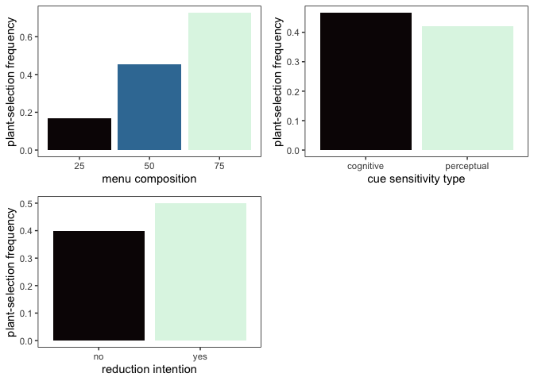

cue_sensitivity
================
2023-10-24

## package and data loading

``` r
library(tidyverse)
```

    ## ── Attaching packages ─────────────────────────────────────── tidyverse 1.3.2 ──
    ## ✔ ggplot2 3.4.1      ✔ purrr   0.3.4 
    ## ✔ tibble  3.1.8      ✔ dplyr   1.0.10
    ## ✔ tidyr   1.2.1      ✔ stringr 1.4.1 
    ## ✔ readr   2.1.2      ✔ forcats 0.5.2 
    ## ── Conflicts ────────────────────────────────────────── tidyverse_conflicts() ──
    ## ✖ dplyr::filter() masks stats::filter()
    ## ✖ dplyr::lag()    masks stats::lag()

``` r
library(ggpubr)
```

``` r
sum_mc <- read_csv("/Users/kenjinchang/github/phd-problemsets/data/dummy_summary_mc.csv")
```

    ## Rows: 3 Columns: 2
    ## ── Column specification ────────────────────────────────────────────────────────
    ## Delimiter: ","
    ## dbl (2): menu_comp, plant_select
    ## 
    ## ℹ Use `spec()` to retrieve the full column specification for this data.
    ## ℹ Specify the column types or set `show_col_types = FALSE` to quiet this message.

``` r
sum_ct <- read_csv("/Users/kenjinchang/github/phd-problemsets/data/dummy_summary_ct.csv")
```

    ## Rows: 2 Columns: 2
    ## ── Column specification ────────────────────────────────────────────────────────
    ## Delimiter: ","
    ## chr (1): cog_type
    ## dbl (1): plant_select
    ## 
    ## ℹ Use `spec()` to retrieve the full column specification for this data.
    ## ℹ Specify the column types or set `show_col_types = FALSE` to quiet this message.

``` r
sum_ri <- read_csv("/Users/kenjinchang/github/phd-problemsets/data/dummy_summary_ri.csv")
```

    ## Rows: 2 Columns: 2
    ## ── Column specification ────────────────────────────────────────────────────────
    ## Delimiter: ","
    ## chr (1): red_int
    ## dbl (1): plant_select
    ## 
    ## ℹ Use `spec()` to retrieve the full column specification for this data.
    ## ℹ Specify the column types or set `show_col_types = FALSE` to quiet this message.

## quick visualizations

### main effect of menu comp on selection

``` r
a <- ggplot(sum_mc,aes(x=menu_comp,y=plant_select,fill=menu_comp)) + 
  geom_col() +
  scale_fill_viridis_c(option="G") +
  xlab("menu composition") +
  ylab("plant-selection frequency") + 
  guides(fill="none") +
  theme(panel.grid=element_blank(),panel.border=element_rect(color="black",fill="NA"),panel.background=element_rect(fill="white"))
```

``` r
b <- ggplot(sum_ct,aes(x=cog_type,y=plant_select,fill=cog_type)) + 
  geom_col() +
  scale_fill_viridis_d(option="G") +
  xlab("cue sensitivity type") +
  ylab("plant-selection frequency") + 
  guides(fill="none") +
  theme(panel.grid=element_blank(),panel.border=element_rect(color="black",fill="NA"),panel.background=element_rect(fill="white"))
```

``` r
c <- ggplot(sum_ri,aes(x=red_int,y=plant_select,fill=red_int)) + 
  geom_col() +
  scale_fill_viridis_d(option="G") +
  xlab("reduction intention") +
  ylab("plant-selection frequency") + 
  guides(fill="none") +
  theme(panel.grid=element_blank(),panel.border=element_rect(color="black",fill="NA"),panel.background=element_rect(fill="white"))
```

``` r
ggarrange(a,b,c,
          ncol=2,nrow=2)
```

<!-- -->
