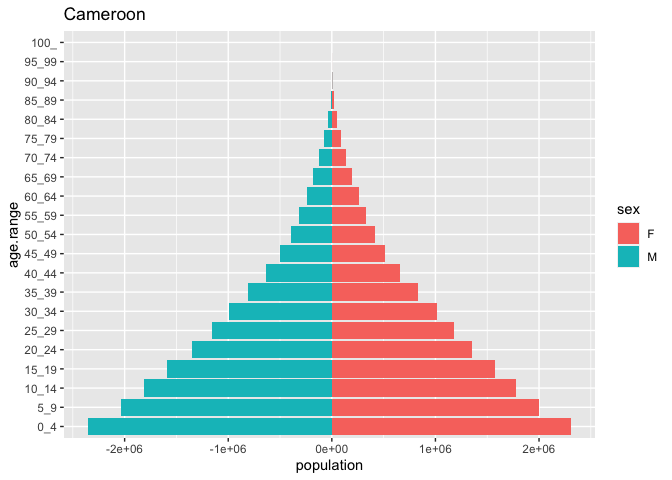
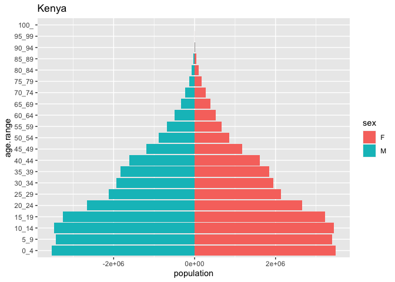
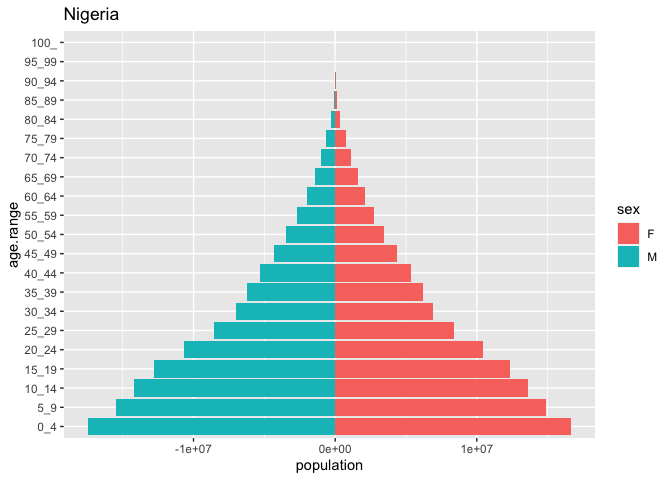
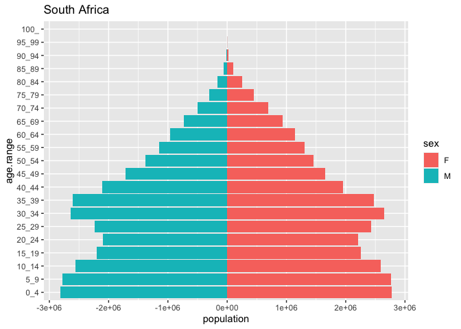
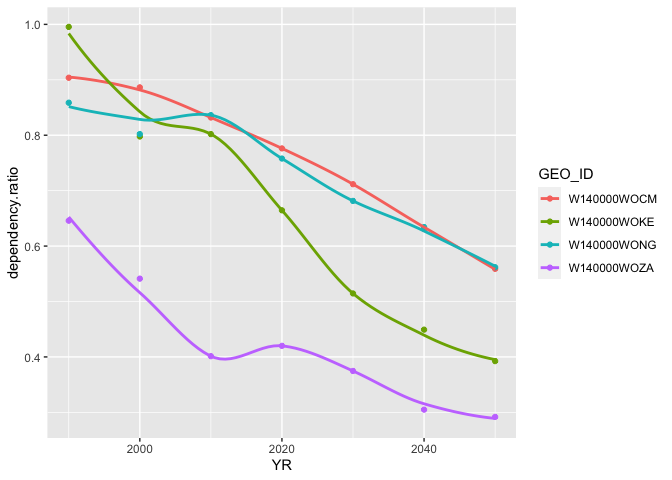

ps1
================
2023-09-22

## Loading in Required Packages

``` r
library(tidyverse)
```

    ## ── Attaching packages ─────────────────────────────────────── tidyverse 1.3.2 ──
    ## ✔ ggplot2 3.4.1      ✔ purrr   0.3.4 
    ## ✔ tibble  3.1.8      ✔ dplyr   1.0.10
    ## ✔ tidyr   1.2.1      ✔ stringr 1.4.1 
    ## ✔ readr   2.1.2      ✔ forcats 0.5.2 
    ## ── Conflicts ────────────────────────────────────────── tidyverse_conflicts() ──
    ## ✖ dplyr::filter() masks stats::filter()
    ## ✖ dplyr::lag()    masks stats::lag()

## Loading in and Cleaning Data

``` r
five_yr_pop_data <- read_delim("/Users/kenjinchang/github/phd-problemsets/data/idb5yr.txt")
```

    ## Rows: 34237 Columns: 115
    ## ── Column specification ────────────────────────────────────────────────────────
    ## Delimiter: "|"
    ## chr   (1): GEO_ID
    ## dbl (114): #YR, AREA_KM2, ASFR15_19, ASFR20_24, ASFR25_29, ASFR30_34, ASFR35...
    ## 
    ## ℹ Use `spec()` to retrieve the full column specification for this data.
    ## ℹ Specify the column types or set `show_col_types = FALSE` to quiet this message.

``` r
pyramid_data <- five_yr_pop_data %>% rename("YR"="#YR") %>% filter(YR==2022) %>% filter(GEO_ID=="W140000WOCM"|GEO_ID=="W140000WOKE"|GEO_ID=="W140000WONG"|GEO_ID=="W140000WOZA") %>% select(YR,GEO_ID,FPOP0_4,FPOP5_9,FPOP10_14,FPOP100_,FPOP15_19,FPOP20_24,FPOP25_29,FPOP30_34,FPOP35_39,FPOP40_44,FPOP45_49,FPOP50_54,FPOP55_59,FPOP60_64,FPOP65_69,FPOP70_74,FPOP75_79,FPOP80_84,FPOP85_89,FPOP90_94,FPOP95_99,MPOP0_4,MPOP5_9,MPOP10_14,MPOP100_,MPOP15_19,MPOP20_24,MPOP25_29,MPOP30_34,MPOP35_39,MPOP40_44,MPOP45_49,MPOP50_54,MPOP55_59,MPOP60_64,MPOP65_69,MPOP70_74,MPOP75_79,MPOP80_84,MPOP85_89,MPOP90_94,MPOP95_99) %>% pivot_longer(cols=c(FPOP0_4,FPOP5_9,FPOP10_14,FPOP15_19,FPOP20_24,FPOP25_29,FPOP30_34,FPOP35_39,FPOP40_44,FPOP45_49,FPOP50_54,FPOP55_59,FPOP60_64,FPOP65_69,FPOP70_74,FPOP75_79,FPOP80_84,FPOP85_89,FPOP90_94,FPOP95_99,FPOP100_,MPOP0_4,MPOP5_9,MPOP10_14,MPOP100_,MPOP15_19,MPOP20_24,MPOP25_29,MPOP30_34,MPOP35_39,MPOP40_44,MPOP45_49,MPOP50_54,MPOP55_59,MPOP60_64,MPOP65_69,MPOP70_74,MPOP75_79,MPOP80_84,MPOP85_89,MPOP90_94,MPOP95_99),
                                                                                                                                                                                                                                                                                                                                                                                                                                                                                                                                                                                                                  names_to="age.range",
                                                                                                                                                                                                                                                                                                                                                                                                                                                                                                                                                                                                                  values_to="population") %>%
  mutate(sex=case_when(str_detect(age.range,"^F")~"F",TRUE~"M")) %>%
  mutate(age.range=str_remove_all(age.range,"MPOP|FPOP"))
pyramid_data %>% head(6)
```

    ## # A tibble: 6 × 5
    ##      YR GEO_ID      age.range population sex  
    ##   <dbl> <chr>       <chr>          <dbl> <chr>
    ## 1  2022 W140000WOCM 0_4          2310425 F    
    ## 2  2022 W140000WOCM 5_9          1997065 F    
    ## 3  2022 W140000WOCM 10_14        1781343 F    
    ## 4  2022 W140000WOCM 15_19        1572737 F    
    ## 5  2022 W140000WOCM 20_24        1357530 F    
    ## 6  2022 W140000WOCM 25_29        1178989 F

ISO codes for Cameroon, Kenya, Nigeria, and South Africa are CM, KE, NG,
and ZA, respectively.The values in the ‘GEO_ID’ column therefore
correspond to the following string of characters: ‘W140000WOCM’,
‘W140000WOKE’, ‘W140000WONG’, and ‘W140000WOZA’.

### Pyramid Construction

The IDB dataset is now *mostly* in a format we can use to generate
population-by-age pyramids. The only thing left to do is to select rows
of observations according to country.

``` r
cameroon_pyramid_data <- filter(pyramid_data,GEO_ID=="W140000WOCM")
cameroon_pyramid_data %>% head(6)
```

    ## # A tibble: 6 × 5
    ##      YR GEO_ID      age.range population sex  
    ##   <dbl> <chr>       <chr>          <dbl> <chr>
    ## 1  2022 W140000WOCM 0_4          2310425 F    
    ## 2  2022 W140000WOCM 5_9          1997065 F    
    ## 3  2022 W140000WOCM 10_14        1781343 F    
    ## 4  2022 W140000WOCM 15_19        1572737 F    
    ## 5  2022 W140000WOCM 20_24        1357530 F    
    ## 6  2022 W140000WOCM 25_29        1178989 F

``` r
kenya_pyramid_data <- filter(pyramid_data,GEO_ID=="W140000WOKE")
kenya_pyramid_data %>% head(6)
```

    ## # A tibble: 6 × 5
    ##      YR GEO_ID      age.range population sex  
    ##   <dbl> <chr>       <chr>          <dbl> <chr>
    ## 1  2022 W140000WOKE 0_4          3487490 F    
    ## 2  2022 W140000WOKE 5_9          3404421 F    
    ## 3  2022 W140000WOKE 10_14        3444606 F    
    ## 4  2022 W140000WOKE 15_19        3225971 F    
    ## 5  2022 W140000WOKE 20_24        2656730 F    
    ## 6  2022 W140000WOKE 25_29        2139208 F

``` r
nigeria_pyramid_data <- filter(pyramid_data,GEO_ID=="W140000WONG")
nigeria_pyramid_data %>% head(6)
```

    ## # A tibble: 6 × 5
    ##      YR GEO_ID      age.range population sex  
    ##   <dbl> <chr>       <chr>          <dbl> <chr>
    ## 1  2022 W140000WONG 0_4         16661775 F    
    ## 2  2022 W140000WONG 5_9         14851524 F    
    ## 3  2022 W140000WONG 10_14       13632837 F    
    ## 4  2022 W140000WONG 15_19       12351433 F    
    ## 5  2022 W140000WONG 20_24       10410201 F    
    ## 6  2022 W140000WONG 25_29        8381860 F

``` r
southafrica_pyramid_data <- filter(pyramid_data,GEO_ID=="W140000WOZA")
southafrica_pyramid_data %>% head(6)
```

    ## # A tibble: 6 × 5
    ##      YR GEO_ID      age.range population sex  
    ##   <dbl> <chr>       <chr>          <dbl> <chr>
    ## 1  2022 W140000WOZA 0_4          2778274 F    
    ## 2  2022 W140000WOZA 5_9          2770062 F    
    ## 3  2022 W140000WOZA 10_14        2589877 F    
    ## 4  2022 W140000WOZA 15_19        2253127 F    
    ## 5  2022 W140000WOZA 20_24        2213139 F    
    ## 6  2022 W140000WOZA 25_29        2431956 F

Now, with these subsets of the ‘pyramid_data’ stored in our environment,
we can finally generate the corresponding pyramid plots.

## Population by Age Pyramids

``` r
cameroon_pyramid_data %>% mutate(population=ifelse(sex=="M",population*(-1),
                                                      population*(1))) %>% 
  ggplot(aes(x=age.range,y=population,fill=sex)) + 
  geom_bar(stat="identity") + 
  scale_x_discrete(limits=c("0_4","5_9","10_14","15_19","20_24","25_29","30_34","35_39","40_44","45_49","50_54","55_59","60_64","65_69","70_74","75_79","80_84","85_89","90_94","95_99","100_")) +
  coord_flip() +
  ggtitle("Cameroon")
```

<!-- -->

``` r
kenya_pyramid_data %>% mutate(population=ifelse(sex=="M",population*(-1),
                                                      population*(1))) %>% 
  ggplot(aes(x=age.range,y=population,fill=sex)) + 
  geom_bar(stat="identity") + 
  scale_x_discrete(limits=c("0_4","5_9","10_14","15_19","20_24","25_29","30_34","35_39","40_44","45_49","50_54","55_59","60_64","65_69","70_74","75_79","80_84","85_89","90_94","95_99","100_")) +
  coord_flip() +
  ggtitle("Kenya")
```

<!-- -->

``` r
nigeria_pyramid_data %>% mutate(population=ifelse(sex=="M",population*(-1),
                                                      population*(1))) %>% 
  ggplot(aes(x=age.range,y=population,fill=sex)) + 
  geom_bar(stat="identity") + 
  scale_x_discrete(limits=c("0_4","5_9","10_14","15_19","20_24","25_29","30_34","35_39","40_44","45_49","50_54","55_59","60_64","65_69","70_74","75_79","80_84","85_89","90_94","95_99","100_")) +
  coord_flip() +
  ggtitle("Nigeria")
```

<!-- -->

``` r
southafrica_pyramid_data %>% mutate(population=ifelse(sex=="M",population*(-1),
                                                      population*(1))) %>% 
  ggplot(aes(x=age.range,y=population,fill=sex)) + 
  geom_bar(stat="identity") + 
  scale_x_discrete(limits=c("0_4","5_9","10_14","15_19","20_24","25_29","30_34","35_39","40_44","45_49","50_54","55_59","60_64","65_69","70_74","75_79","80_84","85_89","90_94","95_99","100_")) +
  coord_flip() +
  ggtitle("South Africa")
```

<!-- -->

We can see that the age distributions across the four investigated
countries vary considerably. South Africa, in particular, stands out, as
there are more people aged 25-29, 30-34, 35-39, and 40-44 than people
aged 20-24.A similar emergent pattern is true for the Kenyan population,
with there being more people aged 10-14 than those aged 5-9. However,
there are some notable consistencies in the distributions across gender,
with there being more females at older age bins relative to males.

## Dependency Ratios

For this section, we will need to reconfigure the data so that it can
serve our calculations.

``` r
five_yr_pop_data <- read_delim("/Users/kenjinchang/github/phd-problemsets/data/idb5yr.txt")
```

    ## Rows: 34237 Columns: 115
    ## ── Column specification ────────────────────────────────────────────────────────
    ## Delimiter: "|"
    ## chr   (1): GEO_ID
    ## dbl (114): #YR, AREA_KM2, ASFR15_19, ASFR20_24, ASFR25_29, ASFR30_34, ASFR35...
    ## 
    ## ℹ Use `spec()` to retrieve the full column specification for this data.
    ## ℹ Specify the column types or set `show_col_types = FALSE` to quiet this message.

``` r
dependency_data <- five_yr_pop_data %>% rename("YR"="#YR") %>% filter(YR==1990|YR==2000|YR==2010|YR==2020|YR==2030|YR==2040|YR==2050) %>% filter(GEO_ID=="W140000WOCM"|GEO_ID=="W140000WOKE"|GEO_ID=="W140000WONG"|GEO_ID=="W140000WOZA")
dependency_data <- dependency_data %>% select(YR,GEO_ID,POP0_4,POP5_9,POP10_14,POP15_19,POP20_24,POP25_29,POP30_34,POP35_39,POP40_44,POP45_49,POP50_54,POP55_59,POP60_64) %>% rowwise() %>% mutate(dependents=sum(POP0_4,POP5_9,POP10_14)) %>% mutate(working=sum(POP15_19,POP20_24,POP25_29,POP30_34,POP35_39,POP40_44,POP45_49,POP50_54,POP55_59,POP60_64)) %>% select(YR,GEO_ID,dependents,working) %>% mutate(dependency.ratio=dependents/working)
dependency_data
```

    ## # A tibble: 28 × 5
    ## # Rowwise: 
    ##       YR GEO_ID      dependents  working dependency.ratio
    ##    <dbl> <chr>            <dbl>    <dbl>            <dbl>
    ##  1  1990 W140000WOCM    5457170  6038585            0.904
    ##  2  2000 W140000WOCM    7229157  8155694            0.886
    ##  3  2010 W140000WOCM    9214107 11075161            0.832
    ##  4  2020 W140000WOCM   11746880 15133054            0.776
    ##  5  2030 W140000WOCM   14562967 20463288            0.712
    ##  6  2040 W140000WOCM   17162572 27207127            0.631
    ##  7  2050 W140000WOCM   19533102 34946461            0.559
    ##  8  1990 W140000WOKE   11315117 11366439            0.995
    ##  9  2000 W140000WOKE   13364623 16753821            0.798
    ## 10  2010 W140000WOKE   18095439 22560835            0.802
    ## # … with 18 more rows

With this all now configured, we can graph the dependency ratios.

``` r
ggplot(dependency_data,aes(x=YR,y=dependency.ratio,color=GEO_ID)) + 
  geom_point() +
  geom_smooth(se=FALSE) 
```

    ## `geom_smooth()` using method = 'loess' and formula = 'y ~ x'

<!-- -->

Based on the above, we can see that, overall, youth dependency is
decreasing, meaning the population aged 15-64, i.e., the denominator, is
increasing at a faster rate than the the population aged 0-15, i.e., the
numerator. We can see that this is expected to happen more suddenly in
some placed than others, e.g., the downward slope demonstrated for Kenya
relative to the softer slope for Cameroon.

### Fertility Rates

Hey, Matt. Had a little trouble using the STATcompiler tool - may be a
browser thing. Will update this repo/doc once I figure out the problem.
