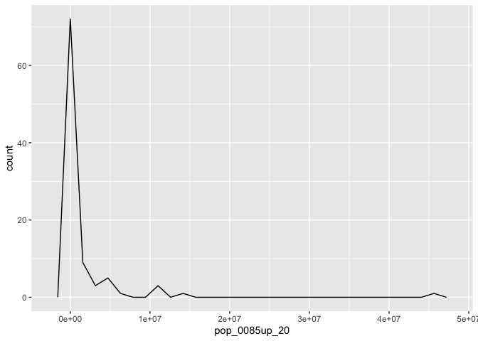
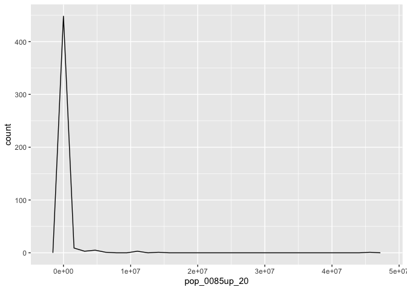

problem set 3
================

## problem set 3

### data and package loading

``` r
library(tidyverse)
```

    ## ── Attaching packages ─────────────────────────────────────── tidyverse 1.3.2 ──
    ## ✔ ggplot2 3.4.1      ✔ purrr   0.3.4 
    ## ✔ tibble  3.1.8      ✔ dplyr   1.0.10
    ## ✔ tidyr   1.2.1      ✔ stringr 1.4.1 
    ## ✔ readr   2.1.2      ✔ forcats 0.5.2 
    ## ── Conflicts ────────────────────────────────────────── tidyverse_conflicts() ──
    ## ✖ dplyr::filter() masks stats::filter()
    ## ✖ dplyr::lag()    masks stats::lag()

``` r
clarktracts <- read.csv("/Users/kenjinchang/github/phd-problemsets/data/clarktracts.csv")
clarktracts %>% head(10)
```

    ##          FIPS              NAME pop_0005_00 pop_0005_10 pop_0509_00 pop_0509_10
    ## 1  3.2003e+10 Census Tract 1.01         441         523         560         532
    ## 2  3.2003e+10 Census Tract 1.03         500         529         521         458
    ## 3  3.2003e+10 Census Tract 1.05         230         293         274         279
    ## 4  3.2003e+10 Census Tract 1.06         250         242         261         281
    ## 5  3.2003e+10 Census Tract 1.07         223         266         233         241
    ## 6  3.2003e+10 Census Tract 1.08         318         357         324         345
    ## 7  3.2003e+10 Census Tract 1.09         323         298         329         265
    ## 8  3.2003e+10 Census Tract 2.01         360         377         320         405
    ## 9  3.2003e+10 Census Tract 2.03         283         240         248         265
    ## 10 3.2003e+10 Census Tract 2.04          40          34          56          42
    ##    pop_0514_00 pop_0514_10 pop_1014_00 pop_1014_10 pop_1524_00 pop_1524_10
    ## 1         1126        1092         566         560         816        1121
    ## 2          943         923         422         465         786         923
    ## 3          543         589         269         310         419         611
    ## 4          506         533         245         252         464         499
    ## 5          450         509         217         268         412         558
    ## 6          581         655         257         310         462         554
    ## 7          590         516         261         251         467         519
    ## 8          569         761         249         356         627         697
    ## 9          483         444         235         179         649         443
    ## 10         106          86          50          44         104          84
    ##    pop_2534_00 pop_2534_10 pop_3544_00 pop_3544_10 pop_4554_00 pop_4554_10
    ## 1          820         861         953         975         803         966
    ## 2         1006         864         910         888         586         683
    ## 3          487         515         538         538         471         555
    ## 4          549         458         607         453         474         522
    ## 5          489         460         539         528         421         525
    ## 6          584         569         542         570         407         435
    ## 7          592         480         549         500         412         508
    ## 8          655         663         561         604         474         512
    ## 9          721         533         719         504         602         548
    ## 10         121         107         134         174         231         131
    ##    pop_5564_00 pop_5564_10 pop_6574_00 pop_6574_10 pop_7584_00 pop_7584_10
    ## 1          610         601         455         414         314         225
    ## 2          394         422         220         249         105         129
    ## 3          340         426         258         251         133         166
    ## 4          396         500         434         520         358         400
    ## 5          353         405         386         328         319         215
    ## 6          300         250         226         174         110          99
    ## 7          304         362         229         224         111         124
    ## 8          313         395         174         350          84         152
    ## 9          385         463         329         235         189         120
    ## 10         165         201         192         177         159         109
    ##    pop_85up_00 pop_85up_10 pop_total_00 pop_total_10
    ## 1           67          73         6411         6851
    ## 2           20          35         5470         5645
    ## 3           39          54         3458         3998
    ## 4           95         136         4139         4263
    ## 5           84          62         3682         3856
    ## 6           23          18         3557         3681
    ## 7           24          36         3608         3567
    ## 8           27          22         3844         4533
    ## 9           59          52         4419         3582
    ## 10          93          54         1345         1157

### projecting population of a single census tract

``` r
p1_clarktracts <- clarktracts %>% 
  filter(NAME=="Census Tract 1.01")
p1_clarktracts %>% head(10)
```

    ##         FIPS              NAME pop_0005_00 pop_0005_10 pop_0509_00 pop_0509_10
    ## 1 3.2003e+10 Census Tract 1.01         441         523         560         532
    ##   pop_0514_00 pop_0514_10 pop_1014_00 pop_1014_10 pop_1524_00 pop_1524_10
    ## 1        1126        1092         566         560         816        1121
    ##   pop_2534_00 pop_2534_10 pop_3544_00 pop_3544_10 pop_4554_00 pop_4554_10
    ## 1         820         861         953         975         803         966
    ##   pop_5564_00 pop_5564_10 pop_6574_00 pop_6574_10 pop_7584_00 pop_7584_10
    ## 1         610         601         455         414         314         225
    ##   pop_85up_00 pop_85up_10 pop_total_00 pop_total_10
    ## 1          67          73         6411         6851

First, we need to solve for the projected population aged 15-44 and the
projected population aged 25-54.

This requires first calculating the CCR for the population aged 15-44
and the population aged 25-54.

Let’s begin with the CCR for the population aged 15-44:

``` r
p1_clarktracts <- clarktracts %>% 
  filter(NAME=="Census Tract 1.01") %>%
  mutate(ccr_1544=((pop_2534_10+pop_3544_10+pop_4554_10))/(pop_1524_00+pop_2534_00+pop_3544_00))
p1_clarktracts %>% head(10)
```

    ##         FIPS              NAME pop_0005_00 pop_0005_10 pop_0509_00 pop_0509_10
    ## 1 3.2003e+10 Census Tract 1.01         441         523         560         532
    ##   pop_0514_00 pop_0514_10 pop_1014_00 pop_1014_10 pop_1524_00 pop_1524_10
    ## 1        1126        1092         566         560         816        1121
    ##   pop_2534_00 pop_2534_10 pop_3544_00 pop_3544_10 pop_4554_00 pop_4554_10
    ## 1         820         861         953         975         803         966
    ##   pop_5564_00 pop_5564_10 pop_6574_00 pop_6574_10 pop_7584_00 pop_7584_10
    ## 1         610         601         455         414         314         225
    ##   pop_85up_00 pop_85up_10 pop_total_00 pop_total_10 ccr_1544
    ## 1          67          73         6411         6851 1.082271

We can see that the associated CCR for the population aged 15-44 is 1.08
(3sf).

Now, we do the same for the CCR for the population aged 25-54:

``` r
p1_clarktracts <- clarktracts %>% 
  filter(NAME=="Census Tract 1.01") %>%
  mutate(ccr_1544=((pop_2534_10+pop_3544_10+pop_4554_10))/(pop_1524_00+pop_2534_00+pop_3544_00)) %>%
  mutate(ccr_2554=((pop_3544_10+pop_4554_10+pop_5564_10))/(pop_2534_00+pop_3544_00+pop_4554_00))
p1_clarktracts %>% head(10)
```

    ##         FIPS              NAME pop_0005_00 pop_0005_10 pop_0509_00 pop_0509_10
    ## 1 3.2003e+10 Census Tract 1.01         441         523         560         532
    ##   pop_0514_00 pop_0514_10 pop_1014_00 pop_1014_10 pop_1524_00 pop_1524_10
    ## 1        1126        1092         566         560         816        1121
    ##   pop_2534_00 pop_2534_10 pop_3544_00 pop_3544_10 pop_4554_00 pop_4554_10
    ## 1         820         861         953         975         803         966
    ##   pop_5564_00 pop_5564_10 pop_6574_00 pop_6574_10 pop_7584_00 pop_7584_10
    ## 1         610         601         455         414         314         225
    ##   pop_85up_00 pop_85up_10 pop_total_00 pop_total_10 ccr_1544  ccr_2554
    ## 1          67          73         6411         6851 1.082271 0.9868012

We can see that the associated CCR for the population aged 25-54 is
0.987 (3sf).

With these CCR values, we can now derive the projected populations for
these age groups in 2020.

We’ll do the 15-44 age distribution first:

``` r
p1_clarktracts <- clarktracts %>% 
  filter(NAME=="Census Tract 1.01") %>%
  mutate(ccr_1544=((pop_2534_10+pop_3544_10+pop_4554_10))/(pop_1524_00+pop_2534_00+pop_3544_00)) %>%
  mutate(ccr_2554=((pop_3544_10+pop_4554_10+pop_5564_10))/(pop_2534_00+pop_3544_00+pop_4554_00)) %>%
  mutate(pop_1544_20=ccr_1544*(pop_1524_10+pop_2534_10+pop_3544_10))
p1_clarktracts %>% head(10)
```

    ##         FIPS              NAME pop_0005_00 pop_0005_10 pop_0509_00 pop_0509_10
    ## 1 3.2003e+10 Census Tract 1.01         441         523         560         532
    ##   pop_0514_00 pop_0514_10 pop_1014_00 pop_1014_10 pop_1524_00 pop_1524_10
    ## 1        1126        1092         566         560         816        1121
    ##   pop_2534_00 pop_2534_10 pop_3544_00 pop_3544_10 pop_4554_00 pop_4554_10
    ## 1         820         861         953         975         803         966
    ##   pop_5564_00 pop_5564_10 pop_6574_00 pop_6574_10 pop_7584_00 pop_7584_10
    ## 1         610         601         455         414         314         225
    ##   pop_85up_00 pop_85up_10 pop_total_00 pop_total_10 ccr_1544  ccr_2554
    ## 1          67          73         6411         6851 1.082271 0.9868012
    ##   pop_1544_20
    ## 1    3200.276

From this, we know that we can expect there to be approximately 3,200
people aged 15-44 in this tract in the year 2020, representing an
increase of 243 people from 2010.

Now, we can do the same for the individuals aged 25-54.

``` r
p1_clarktracts <- clarktracts %>% 
  filter(NAME=="Census Tract 1.01") %>%
  mutate(ccr_1544=((pop_2534_10+pop_3544_10+pop_4554_10))/(pop_1524_00+pop_2534_00+pop_3544_00)) %>%
  mutate(ccr_2554=((pop_3544_10+pop_4554_10+pop_5564_10))/(pop_2534_00+pop_3544_00+pop_4554_00)) %>%
  mutate(pop_1544_20=ccr_1544*(pop_1524_10+pop_2534_10+pop_3544_10)) %>%
  mutate(pop_2454_20=ccr_2554*(pop_2534_10+pop_3544_10+pop_4554_10))
p1_clarktracts %>% head(10)
```

    ##         FIPS              NAME pop_0005_00 pop_0005_10 pop_0509_00 pop_0509_10
    ## 1 3.2003e+10 Census Tract 1.01         441         523         560         532
    ##   pop_0514_00 pop_0514_10 pop_1014_00 pop_1014_10 pop_1524_00 pop_1524_10
    ## 1        1126        1092         566         560         816        1121
    ##   pop_2534_00 pop_2534_10 pop_3544_00 pop_3544_10 pop_4554_00 pop_4554_10
    ## 1         820         861         953         975         803         966
    ##   pop_5564_00 pop_5564_10 pop_6574_00 pop_6574_10 pop_7584_00 pop_7584_10
    ## 1         610         601         455         414         314         225
    ##   pop_85up_00 pop_85up_10 pop_total_00 pop_total_10 ccr_1544  ccr_2554
    ## 1          67          73         6411         6851 1.082271 0.9868012
    ##   pop_1544_20 pop_2454_20
    ## 1    3200.276    2765.017

From this, we know that we can expect there to be approximately 2,765
people aged 25-54 in this tract in the year 2020, representing a
decrease of 37 people from 2010.

With these values calculated, we can now compute the projected
populations for (1) 0-4 year olds,(2) 5-9 year olds, and (3) 10-14 year
olds in 2020.

1.  0-4 year olds in 2020:

``` r
p1_clarktracts <- clarktracts %>% 
  filter(NAME=="Census Tract 1.01") %>%
  mutate(ccr_1544=((pop_2534_10+pop_3544_10+pop_4554_10))/(pop_1524_00+pop_2534_00+pop_3544_00)) %>%
  mutate(ccr_2554=((pop_3544_10+pop_4554_10+pop_5564_10))/(pop_2534_00+pop_3544_00+pop_4554_00)) %>%
  mutate(pop_1544_20=ccr_1544*(pop_1524_10+pop_2534_10+pop_3544_10)) %>%
  mutate(pop_2454_20=ccr_2554*(pop_2534_10+pop_3544_10+pop_4554_10)) %>%
  mutate(pop_0005_20=(pop_0005_10/(pop_1524_10+pop_2534_10+pop_3544_10))*pop_1544_20)
p1_clarktracts %>% head(10)
```

    ##         FIPS              NAME pop_0005_00 pop_0005_10 pop_0509_00 pop_0509_10
    ## 1 3.2003e+10 Census Tract 1.01         441         523         560         532
    ##   pop_0514_00 pop_0514_10 pop_1014_00 pop_1014_10 pop_1524_00 pop_1524_10
    ## 1        1126        1092         566         560         816        1121
    ##   pop_2534_00 pop_2534_10 pop_3544_00 pop_3544_10 pop_4554_00 pop_4554_10
    ## 1         820         861         953         975         803         966
    ##   pop_5564_00 pop_5564_10 pop_6574_00 pop_6574_10 pop_7584_00 pop_7584_10
    ## 1         610         601         455         414         314         225
    ##   pop_85up_00 pop_85up_10 pop_total_00 pop_total_10 ccr_1544  ccr_2554
    ## 1          67          73         6411         6851 1.082271 0.9868012
    ##   pop_1544_20 pop_2454_20 pop_0005_20
    ## 1    3200.276    2765.017    566.0278

As we can see, we can expect there to be approximately 566 people aged
0-4 in this tract in the Year 2020, representing an increase of 43
people from 2010.

2.  5-9 year olds in 2020:

``` r
p1_clarktracts <- clarktracts %>% 
  filter(NAME=="Census Tract 1.01") %>%
  mutate(ccr_1544=((pop_2534_10+pop_3544_10+pop_4554_10))/(pop_1524_00+pop_2534_00+pop_3544_00)) %>%
  mutate(ccr_2554=((pop_3544_10+pop_4554_10+pop_5564_10))/(pop_2534_00+pop_3544_00+pop_4554_00)) %>%
  mutate(pop_1544_20=ccr_1544*(pop_1524_10+pop_2534_10+pop_3544_10)) %>%
  mutate(pop_2454_20=ccr_2554*(pop_2534_10+pop_3544_10+pop_4554_10)) %>%
  mutate(pop_0005_20=(pop_0005_10/(pop_1524_10+pop_2534_10+pop_3544_10))*pop_1544_20) %>%
  mutate(pop_0509_20=(pop_0509_10/(pop_1524_10+pop_2534_10+pop_3544_10))*pop_1544_20)
p1_clarktracts %>% head(10)
```

    ##         FIPS              NAME pop_0005_00 pop_0005_10 pop_0509_00 pop_0509_10
    ## 1 3.2003e+10 Census Tract 1.01         441         523         560         532
    ##   pop_0514_00 pop_0514_10 pop_1014_00 pop_1014_10 pop_1524_00 pop_1524_10
    ## 1        1126        1092         566         560         816        1121
    ##   pop_2534_00 pop_2534_10 pop_3544_00 pop_3544_10 pop_4554_00 pop_4554_10
    ## 1         820         861         953         975         803         966
    ##   pop_5564_00 pop_5564_10 pop_6574_00 pop_6574_10 pop_7584_00 pop_7584_10
    ## 1         610         601         455         414         314         225
    ##   pop_85up_00 pop_85up_10 pop_total_00 pop_total_10 ccr_1544  ccr_2554
    ## 1          67          73         6411         6851 1.082271 0.9868012
    ##   pop_1544_20 pop_2454_20 pop_0005_20 pop_0509_20
    ## 1    3200.276    2765.017    566.0278    575.7683

As we can see, we can expect there to be approximately 578 people aged
5-9 in this tract in the Year 2020, representing an increase of 46
people from 2010.

3.  10-14 yer olds in 2020:

``` r
p1_clarktracts <- clarktracts %>% 
  filter(NAME=="Census Tract 1.01") %>%
  mutate(ccr_1544=((pop_2534_10+pop_3544_10+pop_4554_10))/(pop_1524_00+pop_2534_00+pop_3544_00)) %>%
  mutate(ccr_2554=((pop_3544_10+pop_4554_10+pop_5564_10))/(pop_2534_00+pop_3544_00+pop_4554_00)) %>%
  mutate(pop_1544_20=ccr_1544*(pop_1524_10+pop_2534_10+pop_3544_10)) %>%
  mutate(pop_2554_20=ccr_2554*(pop_2534_10+pop_3544_10+pop_4554_10)) %>%
  mutate(pop_0005_20=(pop_0005_10/(pop_1524_10+pop_2534_10+pop_3544_10))*pop_1544_20) %>%
  mutate(pop_0509_20=(pop_0509_10/(pop_1524_10+pop_2534_10+pop_3544_10))*pop_1544_20) %>%
  mutate(pop_1014_20=(pop_1014_10/(pop_2534_10+pop_3544_10+pop_4554_10))*pop_2554_20)
p1_clarktracts %>% head(10)
```

    ##         FIPS              NAME pop_0005_00 pop_0005_10 pop_0509_00 pop_0509_10
    ## 1 3.2003e+10 Census Tract 1.01         441         523         560         532
    ##   pop_0514_00 pop_0514_10 pop_1014_00 pop_1014_10 pop_1524_00 pop_1524_10
    ## 1        1126        1092         566         560         816        1121
    ##   pop_2534_00 pop_2534_10 pop_3544_00 pop_3544_10 pop_4554_00 pop_4554_10
    ## 1         820         861         953         975         803         966
    ##   pop_5564_00 pop_5564_10 pop_6574_00 pop_6574_10 pop_7584_00 pop_7584_10
    ## 1         610         601         455         414         314         225
    ##   pop_85up_00 pop_85up_10 pop_total_00 pop_total_10 ccr_1544  ccr_2554
    ## 1          67          73         6411         6851 1.082271 0.9868012
    ##   pop_1544_20 pop_2554_20 pop_0005_20 pop_0509_20 pop_1014_20
    ## 1    3200.276    2765.017    566.0278    575.7683    552.6087

As we can see, we can expect there to be approximately 552 people aged
10-14 in this tract in the Year 2020, representing a decrease of 8
people from 2010.

### projecting population of all tracts

Now, we will expand this out to all included tracts within Clark County.

``` r
p2clarktracts <- clarktracts %>% 
  mutate(ccr_1544=((pop_2534_10+pop_3544_10+pop_4554_10))/(pop_1524_00+pop_2534_00+pop_3544_00)) %>%
  mutate(ccr_2554=((pop_3544_10+pop_4554_10+pop_5564_10))/(pop_2534_00+pop_3544_00+pop_4554_00)) %>%
  mutate(pop_1544_20=ccr_1544*(pop_1524_10+pop_2534_10+pop_3544_10)) %>%
  mutate(pop_2554_20=ccr_2554*(pop_2534_10+pop_3544_10+pop_4554_10)) %>%
  mutate(pop_0005_20=(pop_0005_10/(pop_1524_10+pop_2534_10+pop_3544_10))*pop_1544_20) %>%
  mutate(pop_0509_20=(pop_0509_10/(pop_1524_10+pop_2534_10+pop_3544_10))*pop_1544_20) %>%
  mutate(pop_1014_20=(pop_1014_10/(pop_2534_10+pop_3544_10+pop_4554_10))*pop_2554_20)
p2clarktracts %>% 
  head(10)
```

    ##          FIPS              NAME pop_0005_00 pop_0005_10 pop_0509_00 pop_0509_10
    ## 1  3.2003e+10 Census Tract 1.01         441         523         560         532
    ## 2  3.2003e+10 Census Tract 1.03         500         529         521         458
    ## 3  3.2003e+10 Census Tract 1.05         230         293         274         279
    ## 4  3.2003e+10 Census Tract 1.06         250         242         261         281
    ## 5  3.2003e+10 Census Tract 1.07         223         266         233         241
    ## 6  3.2003e+10 Census Tract 1.08         318         357         324         345
    ## 7  3.2003e+10 Census Tract 1.09         323         298         329         265
    ## 8  3.2003e+10 Census Tract 2.01         360         377         320         405
    ## 9  3.2003e+10 Census Tract 2.03         283         240         248         265
    ## 10 3.2003e+10 Census Tract 2.04          40          34          56          42
    ##    pop_0514_00 pop_0514_10 pop_1014_00 pop_1014_10 pop_1524_00 pop_1524_10
    ## 1         1126        1092         566         560         816        1121
    ## 2          943         923         422         465         786         923
    ## 3          543         589         269         310         419         611
    ## 4          506         533         245         252         464         499
    ## 5          450         509         217         268         412         558
    ## 6          581         655         257         310         462         554
    ## 7          590         516         261         251         467         519
    ## 8          569         761         249         356         627         697
    ## 9          483         444         235         179         649         443
    ## 10         106          86          50          44         104          84
    ##    pop_2534_00 pop_2534_10 pop_3544_00 pop_3544_10 pop_4554_00 pop_4554_10
    ## 1          820         861         953         975         803         966
    ## 2         1006         864         910         888         586         683
    ## 3          487         515         538         538         471         555
    ## 4          549         458         607         453         474         522
    ## 5          489         460         539         528         421         525
    ## 6          584         569         542         570         407         435
    ## 7          592         480         549         500         412         508
    ## 8          655         663         561         604         474         512
    ## 9          721         533         719         504         602         548
    ## 10         121         107         134         174         231         131
    ##    pop_5564_00 pop_5564_10 pop_6574_00 pop_6574_10 pop_7584_00 pop_7584_10
    ## 1          610         601         455         414         314         225
    ## 2          394         422         220         249         105         129
    ## 3          340         426         258         251         133         166
    ## 4          396         500         434         520         358         400
    ## 5          353         405         386         328         319         215
    ## 6          300         250         226         174         110          99
    ## 7          304         362         229         224         111         124
    ## 8          313         395         174         350          84         152
    ## 9          385         463         329         235         189         120
    ## 10         165         201         192         177         159         109
    ##    pop_85up_00 pop_85up_10 pop_total_00 pop_total_10  ccr_1544  ccr_2554
    ## 1           67          73         6411         6851 1.0822711 0.9868012
    ## 2           20          35         5470         5645 0.9011843 0.7965627
    ## 3           39          54         3458         3998 1.1135734 1.0153743
    ## 4           95         136         4139         4263 0.8845679 0.9049080
    ## 5           84          62         3682         3856 1.0506944 1.0062112
    ## 6           23          18         3557         3681 0.9911839 0.8186562
    ## 7           24          36         3608         3567 0.9253731 0.8821636
    ## 8           27          22         3844         4533 0.9652740 0.8940828
    ## 9           59          52         4419         3582 0.7587362 0.7419197
    ## 10          93          54         1345         1157 1.1476323 1.0411523
    ##    pop_1544_20 pop_2554_20 pop_0005_20 pop_0509_20 pop_1014_20
    ## 1    3200.2758   2765.0171    566.0278   575.76825    552.6087
    ## 2    2410.6680   1939.6303    476.7265   412.74241    370.4017
    ## 3    1852.9861   1632.7219    326.2770   310.68698    314.7660
    ## 4    1247.2407   1296.7331    214.0654   248.56358    228.0368
    ## 5    1624.3736   1522.3975    279.4847   253.21736    269.6646
    ## 6    1678.0743   1288.5649    353.8526   341.95844    253.7834
    ## 7    1387.1343   1312.6594    275.7612   245.22388    221.4231
    ## 8    1895.7982   1590.5734    363.9083   390.93597    318.2935
    ## 9    1122.9296   1175.9427    182.0967   201.06510    132.8036
    ## 10    418.8858    428.9547     39.0195    48.20056     45.8107

### exploring components of area where projected population exceeds 10,000

First, in order to accomplish this, we’ll have to generate a new column
that sums the projected population aged 0-85+.

To start this process, we will first calculate the CCR for the
population aged 0-85+.

``` r
p3clarktracts <- clarktracts %>% 
  mutate(ccr_1544=((pop_2534_10+pop_3544_10+pop_4554_10))/(pop_1524_00+pop_2534_00+pop_3544_00)) %>%
  mutate(ccr_2554=((pop_3544_10+pop_4554_10+pop_5564_10))/(pop_2534_00+pop_3544_00+pop_4554_00)) %>%
  mutate(pop_1544_20=ccr_1544*(pop_1524_10+pop_2534_10+pop_3544_10)) %>%
  mutate(pop_2554_20=ccr_2554*(pop_2534_10+pop_3544_10+pop_4554_10)) %>%
  mutate(pop_0005_20=(pop_0005_10/(pop_1524_10+pop_2534_10+pop_3544_10))*pop_1544_20) %>%
  mutate(pop_0509_20=(pop_0509_10/(pop_1524_10+pop_2534_10+pop_3544_10))*pop_1544_20) %>%
  mutate(pop_1014_20=(pop_1014_10/(pop_2534_10+pop_3544_10+pop_4554_10))*pop_2554_20) %>%
  mutate(ccr_0085up=((pop_1014_10+pop_1524_10+pop_2534_10+pop_3544_10+pop_4554_10+pop_5564_10+pop_6574_10+pop_7584_10+pop_85up_10))/(pop_total_00))
p3clarktracts %>% 
  head(10)
```

    ##          FIPS              NAME pop_0005_00 pop_0005_10 pop_0509_00 pop_0509_10
    ## 1  3.2003e+10 Census Tract 1.01         441         523         560         532
    ## 2  3.2003e+10 Census Tract 1.03         500         529         521         458
    ## 3  3.2003e+10 Census Tract 1.05         230         293         274         279
    ## 4  3.2003e+10 Census Tract 1.06         250         242         261         281
    ## 5  3.2003e+10 Census Tract 1.07         223         266         233         241
    ## 6  3.2003e+10 Census Tract 1.08         318         357         324         345
    ## 7  3.2003e+10 Census Tract 1.09         323         298         329         265
    ## 8  3.2003e+10 Census Tract 2.01         360         377         320         405
    ## 9  3.2003e+10 Census Tract 2.03         283         240         248         265
    ## 10 3.2003e+10 Census Tract 2.04          40          34          56          42
    ##    pop_0514_00 pop_0514_10 pop_1014_00 pop_1014_10 pop_1524_00 pop_1524_10
    ## 1         1126        1092         566         560         816        1121
    ## 2          943         923         422         465         786         923
    ## 3          543         589         269         310         419         611
    ## 4          506         533         245         252         464         499
    ## 5          450         509         217         268         412         558
    ## 6          581         655         257         310         462         554
    ## 7          590         516         261         251         467         519
    ## 8          569         761         249         356         627         697
    ## 9          483         444         235         179         649         443
    ## 10         106          86          50          44         104          84
    ##    pop_2534_00 pop_2534_10 pop_3544_00 pop_3544_10 pop_4554_00 pop_4554_10
    ## 1          820         861         953         975         803         966
    ## 2         1006         864         910         888         586         683
    ## 3          487         515         538         538         471         555
    ## 4          549         458         607         453         474         522
    ## 5          489         460         539         528         421         525
    ## 6          584         569         542         570         407         435
    ## 7          592         480         549         500         412         508
    ## 8          655         663         561         604         474         512
    ## 9          721         533         719         504         602         548
    ## 10         121         107         134         174         231         131
    ##    pop_5564_00 pop_5564_10 pop_6574_00 pop_6574_10 pop_7584_00 pop_7584_10
    ## 1          610         601         455         414         314         225
    ## 2          394         422         220         249         105         129
    ## 3          340         426         258         251         133         166
    ## 4          396         500         434         520         358         400
    ## 5          353         405         386         328         319         215
    ## 6          300         250         226         174         110          99
    ## 7          304         362         229         224         111         124
    ## 8          313         395         174         350          84         152
    ## 9          385         463         329         235         189         120
    ## 10         165         201         192         177         159         109
    ##    pop_85up_00 pop_85up_10 pop_total_00 pop_total_10  ccr_1544  ccr_2554
    ## 1           67          73         6411         6851 1.0822711 0.9868012
    ## 2           20          35         5470         5645 0.9011843 0.7965627
    ## 3           39          54         3458         3998 1.1135734 1.0153743
    ## 4           95         136         4139         4263 0.8845679 0.9049080
    ## 5           84          62         3682         3856 1.0506944 1.0062112
    ## 6           23          18         3557         3681 0.9911839 0.8186562
    ## 7           24          36         3608         3567 0.9253731 0.8821636
    ## 8           27          22         3844         4533 0.9652740 0.8940828
    ## 9           59          52         4419         3582 0.7587362 0.7419197
    ## 10          93          54         1345         1157 1.1476323 1.0411523
    ##    pop_1544_20 pop_2554_20 pop_0005_20 pop_0509_20 pop_1014_20 ccr_0085up
    ## 1    3200.2758   2765.0171    566.0278   575.76825    552.6087  0.9040711
    ## 2    2410.6680   1939.6303    476.7265   412.74241    370.4017  0.8515539
    ## 3    1852.9861   1632.7219    326.2770   310.68698    314.7660  0.9907461
    ## 4    1247.2407   1296.7331    214.0654   248.56358    228.0368  0.9035999
    ## 5    1624.3736   1522.3975    279.4847   253.21736    269.6646  0.9095600
    ## 6    1678.0743   1288.5649    353.8526   341.95844    253.7834  0.8375035
    ## 7    1387.1343   1312.6594    275.7612   245.22388    221.4231  0.8325942
    ## 8    1895.7982   1590.5734    363.9083   390.93597    318.2935  0.9758065
    ## 9    1122.9296   1175.9427    182.0967   201.06510    132.8036  0.6963114
    ## 10    418.8858    428.9547     39.0195    48.20056     45.8107  0.8037175

With this complete, we can now calculate the corresponding population
projection:

``` r
p3clarktracts <- clarktracts %>% 
  mutate(ccr_1544=((pop_2534_10+pop_3544_10+pop_4554_10))/(pop_1524_00+pop_2534_00+pop_3544_00)) %>%
  mutate(ccr_2554=((pop_3544_10+pop_4554_10+pop_5564_10))/(pop_2534_00+pop_3544_00+pop_4554_00)) %>%
  mutate(pop_1544_20=ccr_1544*(pop_1524_10+pop_2534_10+pop_3544_10)) %>%
  mutate(pop_2554_20=ccr_2554*(pop_2534_10+pop_3544_10+pop_4554_10)) %>%
  mutate(pop_0005_20=(pop_0005_10/(pop_1524_10+pop_2534_10+pop_3544_10))*pop_1544_20) %>%
  mutate(pop_0509_20=(pop_0509_10/(pop_1524_10+pop_2534_10+pop_3544_10))*pop_1544_20) %>%
  mutate(pop_1014_20=(pop_1014_10/(pop_2534_10+pop_3544_10+pop_4554_10))*pop_2554_20) %>%
  mutate(ccr_0085up=((pop_1014_10+pop_1524_10+pop_2534_10+pop_3544_10+pop_4554_10+pop_5564_10+pop_6574_10+pop_7584_10+pop_85up_10))/(pop_total_00)) %>%
  mutate(pop_0085up_20=ccr_0085up*pop_total_10)
p3clarktracts %>% head(10)
```

    ##          FIPS              NAME pop_0005_00 pop_0005_10 pop_0509_00 pop_0509_10
    ## 1  3.2003e+10 Census Tract 1.01         441         523         560         532
    ## 2  3.2003e+10 Census Tract 1.03         500         529         521         458
    ## 3  3.2003e+10 Census Tract 1.05         230         293         274         279
    ## 4  3.2003e+10 Census Tract 1.06         250         242         261         281
    ## 5  3.2003e+10 Census Tract 1.07         223         266         233         241
    ## 6  3.2003e+10 Census Tract 1.08         318         357         324         345
    ## 7  3.2003e+10 Census Tract 1.09         323         298         329         265
    ## 8  3.2003e+10 Census Tract 2.01         360         377         320         405
    ## 9  3.2003e+10 Census Tract 2.03         283         240         248         265
    ## 10 3.2003e+10 Census Tract 2.04          40          34          56          42
    ##    pop_0514_00 pop_0514_10 pop_1014_00 pop_1014_10 pop_1524_00 pop_1524_10
    ## 1         1126        1092         566         560         816        1121
    ## 2          943         923         422         465         786         923
    ## 3          543         589         269         310         419         611
    ## 4          506         533         245         252         464         499
    ## 5          450         509         217         268         412         558
    ## 6          581         655         257         310         462         554
    ## 7          590         516         261         251         467         519
    ## 8          569         761         249         356         627         697
    ## 9          483         444         235         179         649         443
    ## 10         106          86          50          44         104          84
    ##    pop_2534_00 pop_2534_10 pop_3544_00 pop_3544_10 pop_4554_00 pop_4554_10
    ## 1          820         861         953         975         803         966
    ## 2         1006         864         910         888         586         683
    ## 3          487         515         538         538         471         555
    ## 4          549         458         607         453         474         522
    ## 5          489         460         539         528         421         525
    ## 6          584         569         542         570         407         435
    ## 7          592         480         549         500         412         508
    ## 8          655         663         561         604         474         512
    ## 9          721         533         719         504         602         548
    ## 10         121         107         134         174         231         131
    ##    pop_5564_00 pop_5564_10 pop_6574_00 pop_6574_10 pop_7584_00 pop_7584_10
    ## 1          610         601         455         414         314         225
    ## 2          394         422         220         249         105         129
    ## 3          340         426         258         251         133         166
    ## 4          396         500         434         520         358         400
    ## 5          353         405         386         328         319         215
    ## 6          300         250         226         174         110          99
    ## 7          304         362         229         224         111         124
    ## 8          313         395         174         350          84         152
    ## 9          385         463         329         235         189         120
    ## 10         165         201         192         177         159         109
    ##    pop_85up_00 pop_85up_10 pop_total_00 pop_total_10  ccr_1544  ccr_2554
    ## 1           67          73         6411         6851 1.0822711 0.9868012
    ## 2           20          35         5470         5645 0.9011843 0.7965627
    ## 3           39          54         3458         3998 1.1135734 1.0153743
    ## 4           95         136         4139         4263 0.8845679 0.9049080
    ## 5           84          62         3682         3856 1.0506944 1.0062112
    ## 6           23          18         3557         3681 0.9911839 0.8186562
    ## 7           24          36         3608         3567 0.9253731 0.8821636
    ## 8           27          22         3844         4533 0.9652740 0.8940828
    ## 9           59          52         4419         3582 0.7587362 0.7419197
    ## 10          93          54         1345         1157 1.1476323 1.0411523
    ##    pop_1544_20 pop_2554_20 pop_0005_20 pop_0509_20 pop_1014_20 ccr_0085up
    ## 1    3200.2758   2765.0171    566.0278   575.76825    552.6087  0.9040711
    ## 2    2410.6680   1939.6303    476.7265   412.74241    370.4017  0.8515539
    ## 3    1852.9861   1632.7219    326.2770   310.68698    314.7660  0.9907461
    ## 4    1247.2407   1296.7331    214.0654   248.56358    228.0368  0.9035999
    ## 5    1624.3736   1522.3975    279.4847   253.21736    269.6646  0.9095600
    ## 6    1678.0743   1288.5649    353.8526   341.95844    253.7834  0.8375035
    ## 7    1387.1343   1312.6594    275.7612   245.22388    221.4231  0.8325942
    ## 8    1895.7982   1590.5734    363.9083   390.93597    318.2935  0.9758065
    ## 9    1122.9296   1175.9427    182.0967   201.06510    132.8036  0.6963114
    ## 10    418.8858    428.9547     39.0195    48.20056     45.8107  0.8037175
    ##    pop_0085up_20
    ## 1      6193.7913
    ## 2      4807.0219
    ## 3      3961.0029
    ## 4      3852.0464
    ## 5      3507.2634
    ## 6      3082.8504
    ## 7      2969.8636
    ## 8      4423.3306
    ## 9      2494.1874
    ## 10      929.9011

With this new variable generated, we can sort the tracts in descending
order based on the newly projected populations (after removing `Inf`
instances):

``` r
p3clarktracts <- clarktracts %>% 
  mutate(ccr_0085up=((pop_1014_10+pop_1524_10+pop_2534_10+pop_3544_10+pop_4554_10+pop_5564_10+pop_6574_10+pop_7584_10+pop_85up_10))/(pop_total_00)) %>%
  mutate(pop_0085up_20=ccr_0085up*pop_total_10) %>% 
  filter(is.finite(pop_0085up_20)) %>%
  arrange(desc(pop_0085up_20)) 
p3clarktracts %>% head(10)
```

    ##           FIPS               NAME pop_0005_00 pop_0005_10 pop_0509_00
    ## 1  32003003618 Census Tract 36.18           0         776           0
    ## 2  32003003622 Census Tract 36.22           0         528           0
    ## 3  32003003237 Census Tract 32.37           0         280           0
    ## 4  32003003234 Census Tract 32.34           0         367           0
    ## 5  32003003620 Census Tract 36.20           0         481           0
    ## 6  32003005716 Census Tract 57.16           0           5           0
    ## 7  32003003228 Census Tract 32.28           0         397           0
    ## 8  32003005013 Census Tract 50.13           0         335           0
    ## 9  32003003230 Census Tract 32.30           0         678           0
    ## 10 32003005713 Census Tract 57.13           0         273           0
    ##    pop_0509_10 pop_0514_00 pop_0514_10 pop_1014_00 pop_1014_10 pop_1524_00
    ## 1          657           0        1179           0         522           0
    ## 2          563           0        1053           0         490           0
    ## 3          246           0         494           0         248           0
    ## 4          297           0         571           0         274           0
    ## 5          460           0         907           0         447           0
    ## 6            4           0           6           0           2           0
    ## 7          313           0         574           0         261           0
    ## 8          346           0         645           0         299           0
    ## 9          497           0         937           0         440           0
    ## 10         241           0         436           0         195           0
    ##    pop_1524_10 pop_2534_00 pop_2534_10 pop_3544_00 pop_3544_10 pop_4554_00
    ## 1          874           0        1614           0        1335           0
    ## 2          757           0        1006           0         949           0
    ## 3          400           0         656           0         697           0
    ## 4          530           0         902           0         633           0
    ## 5          579           0         939           0         905           0
    ## 6           43           0          89           0          83           0
    ## 7          400           0         936           0         587           0
    ## 8          598           0         660           0         593           0
    ## 9          811           0        1521           1        1032           1
    ## 10         238           0         457           0         675           0
    ##    pop_4554_10 pop_5564_00 pop_5564_10 pop_6574_00 pop_6574_10 pop_7584_00
    ## 1          784           0         601           0         248           0
    ## 2          704           0         437           0         234           0
    ## 3          524           0         334           0         196           0
    ## 4          365           0         201           0          84           0
    ## 5          608           0         359           0         188           0
    ## 6          284           0        1451           0        1157           0
    ## 7          360           0         258           0         138           0
    ## 8          358           0         274           0         106           0
    ## 9          534           0         374           0         174           0
    ## 10         539           1        1141           0         821           0
    ##    pop_7584_10 pop_85up_00 pop_85up_10 pop_total_00 pop_total_10 ccr_0085up
    ## 1           77           0          22            1         7510  6077.0000
    ## 2           71           0          13            2         5752  2330.5000
    ## 3           68           0          20            1         3669  3143.0000
    ## 4           33           0           4            1         3690  3026.0000
    ## 5           46           0           7            2         5019  2039.0000
    ## 6          384           0          83            2         3585  1788.0000
    ## 7           32           0           2            2         3684  1487.0000
    ## 8           37           0          10            2         3616  1467.5000
    ## 9           40           0          11            7         6112   705.2857
    ## 10         255           0          45            5         4880   873.2000
    ##    pop_0085up_20
    ## 1       45638270
    ## 2       13405036
    ## 3       11531667
    ## 4       11165940
    ## 5       10233741
    ## 6        6409980
    ## 7        5478108
    ## 8        5306480
    ## 9        4310706
    ## 10       4261216

Better yet, if we wanted to isolate the tracts with a projected
population greater than 10,000, we can do the following:

``` r
p3clarktracts <- clarktracts %>% 
  mutate(ccr_0085up=((pop_1014_10+pop_1524_10+pop_2534_10+pop_3544_10+pop_4554_10+pop_5564_10+pop_6574_10+pop_7584_10+pop_85up_10))/(pop_total_00)) %>%
  mutate(pop_0085up_20=ccr_0085up*pop_total_10) %>% 
  filter(is.finite(pop_0085up_20)) %>%
  filter(pop_0085up_20>=10000) %>%
  arrange(desc(pop_0085up_20))
p3clarktracts %>% head(10)
```

    ##           FIPS               NAME pop_0005_00 pop_0005_10 pop_0509_00
    ## 1  32003003618 Census Tract 36.18           0         776           0
    ## 2  32003003622 Census Tract 36.22           0         528           0
    ## 3  32003003237 Census Tract 32.37           0         280           0
    ## 4  32003003234 Census Tract 32.34           0         367           0
    ## 5  32003003620 Census Tract 36.20           0         481           0
    ## 6  32003005716 Census Tract 57.16           0           5           0
    ## 7  32003003228 Census Tract 32.28           0         397           0
    ## 8  32003005013 Census Tract 50.13           0         335           0
    ## 9  32003003230 Census Tract 32.30           0         678           0
    ## 10 32003005713 Census Tract 57.13           0         273           0
    ##    pop_0509_10 pop_0514_00 pop_0514_10 pop_1014_00 pop_1014_10 pop_1524_00
    ## 1          657           0        1179           0         522           0
    ## 2          563           0        1053           0         490           0
    ## 3          246           0         494           0         248           0
    ## 4          297           0         571           0         274           0
    ## 5          460           0         907           0         447           0
    ## 6            4           0           6           0           2           0
    ## 7          313           0         574           0         261           0
    ## 8          346           0         645           0         299           0
    ## 9          497           0         937           0         440           0
    ## 10         241           0         436           0         195           0
    ##    pop_1524_10 pop_2534_00 pop_2534_10 pop_3544_00 pop_3544_10 pop_4554_00
    ## 1          874           0        1614           0        1335           0
    ## 2          757           0        1006           0         949           0
    ## 3          400           0         656           0         697           0
    ## 4          530           0         902           0         633           0
    ## 5          579           0         939           0         905           0
    ## 6           43           0          89           0          83           0
    ## 7          400           0         936           0         587           0
    ## 8          598           0         660           0         593           0
    ## 9          811           0        1521           1        1032           1
    ## 10         238           0         457           0         675           0
    ##    pop_4554_10 pop_5564_00 pop_5564_10 pop_6574_00 pop_6574_10 pop_7584_00
    ## 1          784           0         601           0         248           0
    ## 2          704           0         437           0         234           0
    ## 3          524           0         334           0         196           0
    ## 4          365           0         201           0          84           0
    ## 5          608           0         359           0         188           0
    ## 6          284           0        1451           0        1157           0
    ## 7          360           0         258           0         138           0
    ## 8          358           0         274           0         106           0
    ## 9          534           0         374           0         174           0
    ## 10         539           1        1141           0         821           0
    ##    pop_7584_10 pop_85up_00 pop_85up_10 pop_total_00 pop_total_10 ccr_0085up
    ## 1           77           0          22            1         7510  6077.0000
    ## 2           71           0          13            2         5752  2330.5000
    ## 3           68           0          20            1         3669  3143.0000
    ## 4           33           0           4            1         3690  3026.0000
    ## 5           46           0           7            2         5019  2039.0000
    ## 6          384           0          83            2         3585  1788.0000
    ## 7           32           0           2            2         3684  1487.0000
    ## 8           37           0          10            2         3616  1467.5000
    ## 9           40           0          11            7         6112   705.2857
    ## 10         255           0          45            5         4880   873.2000
    ##    pop_0085up_20
    ## 1       45638270
    ## 2       13405036
    ## 3       11531667
    ## 4       11165940
    ## 5       10233741
    ## 6        6409980
    ## 7        5478108
    ## 8        5306480
    ## 9        4310706
    ## 10       4261216

``` r
ggplot(p3clarktracts,aes(pop_0085up_20)) + 
  geom_freqpoly()
```

    ## `stat_bin()` using `bins = 30`. Pick better value with `binwidth`.

<!-- -->

As mentioned in the problem site, this is likely driven by these
particular areas experiencing rapid population growth, which can cause
the projections to overestimate changes in population.

### solving for this issue

A rudimentary way of solving for this is by imposing a ceiling of
10,000:

``` r
p4clarktracts <- clarktracts %>% 
  mutate(ccr_0085up=((pop_1014_10+pop_1524_10+pop_2534_10+pop_3544_10+pop_4554_10+pop_5564_10+pop_6574_10+pop_7584_10+pop_85up_10))/(pop_total_00)) %>%
  mutate(pop_0085up_20=ccr_0085up*pop_total_10) %>% 
  filter(is.finite(pop_0085up_20)) %>%
  arrange(desc(pop_0085up_20)) %>%
  mutate(pop_0085up_20_ceiling=if_else(pop_0085up_20>=10000,10000,pop_0085up_20)) 
p4clarktracts %>% head(10)
```

    ##           FIPS               NAME pop_0005_00 pop_0005_10 pop_0509_00
    ## 1  32003003618 Census Tract 36.18           0         776           0
    ## 2  32003003622 Census Tract 36.22           0         528           0
    ## 3  32003003237 Census Tract 32.37           0         280           0
    ## 4  32003003234 Census Tract 32.34           0         367           0
    ## 5  32003003620 Census Tract 36.20           0         481           0
    ## 6  32003005716 Census Tract 57.16           0           5           0
    ## 7  32003003228 Census Tract 32.28           0         397           0
    ## 8  32003005013 Census Tract 50.13           0         335           0
    ## 9  32003003230 Census Tract 32.30           0         678           0
    ## 10 32003005713 Census Tract 57.13           0         273           0
    ##    pop_0509_10 pop_0514_00 pop_0514_10 pop_1014_00 pop_1014_10 pop_1524_00
    ## 1          657           0        1179           0         522           0
    ## 2          563           0        1053           0         490           0
    ## 3          246           0         494           0         248           0
    ## 4          297           0         571           0         274           0
    ## 5          460           0         907           0         447           0
    ## 6            4           0           6           0           2           0
    ## 7          313           0         574           0         261           0
    ## 8          346           0         645           0         299           0
    ## 9          497           0         937           0         440           0
    ## 10         241           0         436           0         195           0
    ##    pop_1524_10 pop_2534_00 pop_2534_10 pop_3544_00 pop_3544_10 pop_4554_00
    ## 1          874           0        1614           0        1335           0
    ## 2          757           0        1006           0         949           0
    ## 3          400           0         656           0         697           0
    ## 4          530           0         902           0         633           0
    ## 5          579           0         939           0         905           0
    ## 6           43           0          89           0          83           0
    ## 7          400           0         936           0         587           0
    ## 8          598           0         660           0         593           0
    ## 9          811           0        1521           1        1032           1
    ## 10         238           0         457           0         675           0
    ##    pop_4554_10 pop_5564_00 pop_5564_10 pop_6574_00 pop_6574_10 pop_7584_00
    ## 1          784           0         601           0         248           0
    ## 2          704           0         437           0         234           0
    ## 3          524           0         334           0         196           0
    ## 4          365           0         201           0          84           0
    ## 5          608           0         359           0         188           0
    ## 6          284           0        1451           0        1157           0
    ## 7          360           0         258           0         138           0
    ## 8          358           0         274           0         106           0
    ## 9          534           0         374           0         174           0
    ## 10         539           1        1141           0         821           0
    ##    pop_7584_10 pop_85up_00 pop_85up_10 pop_total_00 pop_total_10 ccr_0085up
    ## 1           77           0          22            1         7510  6077.0000
    ## 2           71           0          13            2         5752  2330.5000
    ## 3           68           0          20            1         3669  3143.0000
    ## 4           33           0           4            1         3690  3026.0000
    ## 5           46           0           7            2         5019  2039.0000
    ## 6          384           0          83            2         3585  1788.0000
    ## 7           32           0           2            2         3684  1487.0000
    ## 8           37           0          10            2         3616  1467.5000
    ## 9           40           0          11            7         6112   705.2857
    ## 10         255           0          45            5         4880   873.2000
    ##    pop_0085up_20 pop_0085up_20_ceiling
    ## 1       45638270                 10000
    ## 2       13405036                 10000
    ## 3       11531667                 10000
    ## 4       11165940                 10000
    ## 5       10233741                 10000
    ## 6        6409980                 10000
    ## 7        5478108                 10000
    ## 8        5306480                 10000
    ## 9        4310706                 10000
    ## 10       4261216                 10000

``` r
ggplot(p4clarktracts,aes(pop_0085up_20)) + 
  geom_freqpoly()
```

    ## `stat_bin()` using `bins = 30`. Pick better value with `binwidth`.

<!-- -->
